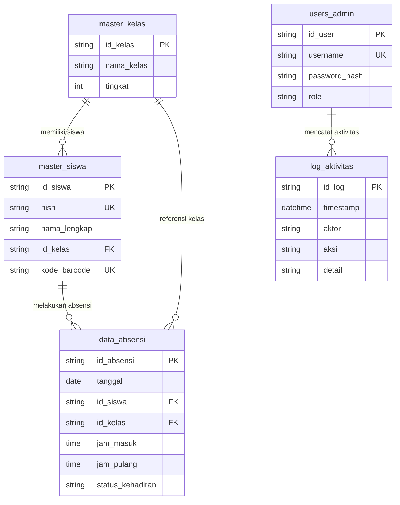

# 🗄️ Desain Database (Google Sheets Structure)
# **SIPRESMATA — MIN 5 Tulungagung**
> Spreadsheet Database: [Buka Google Sheets](https://docs.google.com/spreadsheets/d/1BbmMgggGUSOhnXfMW4VMzg7u_L9HGWfuPRbd7c1JM7ksOgEeF8_TwgXh/edit?usp=sharing) (`ID: 1BbmMgggGUSOhnXfMW4VMzg7u_L9HGWfuPRbd7c1JM7ksOgEeF8_TwgXh`)

Dokumen ini menjelaskan struktur buku kerja (*workbook*) Google Sheets yang bertindak sebagai basis data *relational-like* untuk backend Google Apps Script SIPRESMATA.

---

### 1. Daftar Sheet & Fungsinya

| Nama Sheet | Fungsi Utama | Kategori |
| :--- | :--- | :--- |
| `master_siswa` | Menyimpan data profil seluruh siswa aktif MIN 5 beserta kode barcode uniknya. | Master Data |
| `master_kelas` | Menyimpan daftar kelas/rombongan belajar dan nama wali kelas. | Master Data |
| `data_absensi` | Mencatat riwayat transaksi kehadiran harian (scan masuk, scan pulang, izin, sakit, alpa). | Transaksional |
| `users_admin` | Menyimpan kredensial admin/petugas piket (username, hash password/PIN, peran). | Otentikasi |
| `pengaturan_sekolah`| Menyimpan parameter operasional (jam masuk, jam pulang, toleransi terlambat, nama madrasah). | Konfigurasi |
| `log_aktivitas` | Mencatat riwayat aktivitas penting (login, edit data siswa, manual input absensi) untuk audit trail. | Log / Audit |

---

### 2. Skema Kolom Detail per Sheet

#### A. Sheet `master_siswa`
| No | Nama Kolom | Tipe Data | Wajib? | Contoh Isi | Keterangan |
|---|---|---|---|---|---|
| 1 | `id_siswa` | String (PK) | Ya | `SISWA-001` | Identifier unik internal siswa |
| 2 | `nisn` | String (Unique) | Ya | `0123456789` | NISN resmi siswa dari Kemdikbud/Kemenag |
| 3 | `nama_lengkap` | String | Ya | `Muhammad Rayhan Al-Fatih` | Nama lengkap siswa |
| 4 | `id_kelas` | String (FK) | Ya | `KLS-1A` | Relasi ke sheet `master_kelas` |
| 5 | `jenis_kelamin` | String (L/P) | Ya | `L` | `L` (Laki-laki) atau `P` (Perempuan) |
| 6 | `kode_barcode` | String (Unique) | Ya | `MIN5-0123456789` | Nilai data barcode yang dicetak di kartu |
| 7 | `no_hp_ortu` | String | Opsional| `081234567890` | Nomor WhatsApp orang tua (format `628...`) |
| 8 | `status_aktif` | Boolean | Ya | `TRUE` | `TRUE` (Aktif), `FALSE` (Pindah/Lulus) |
| 9 | `created_at` | DateTime ISO | Ya | `2026-07-15 08:00:00` | Waktu data dibuat |

#### B. Sheet `master_kelas`
| No | Nama Kolom | Tipe Data | Wajib? | Contoh Isi | Keterangan |
|---|---|---|---|---|---|
| 1 | `id_kelas` | String (PK) | Ya | `KLS-1A` | Kode unik kelas |
| 2 | `nama_kelas` | String | Ya | `Kelas 1A (Abu Bakar)` | Nama kelas tampilan |
| 3 | `tingkat` | Integer | Ya | `1` | Angka 1 s.d. 6 |
| 4 | `nama_wali_kelas`| String | Opsional| `Ustadzah Nurul Hidayah, S.Pd.I` | Nama wali kelas |
| 5 | `ruangan` | String | Opsional| `Gedung A - Lt 1.01` | Lokasi fisik kelas |

#### C. Sheet `data_absensi`
| No | Nama Kolom | Tipe Data | Wajib? | Contoh Isi | Keterangan |
|---|---|---|---|---|---|
| 1 | `id_absensi` | String (PK) | Ya | `ABS-20260829-001` | Unique ID transaksi absensi |
| 2 | `tanggal` | Date (ISO) | Ya | `2026-08-29` | Tanggal absensi format `YYYY-MM-DD` |
| 3 | `id_siswa` | String (FK) | Ya | `SISWA-001` | Relasi ke `master_siswa.id_siswa` |
| 4 | `id_kelas` | String (FK) | Ya | `KLS-1A` | Snapshot kelas saat absen |
| 5 | `jam_masuk` | Time (HH:mm:ss)| Opsional| `06:58:21` | Waktu scan masuk |
| 6 | `jam_pulang` | Time (HH:mm:ss)| Opsional| `13:05:14` | Waktu scan pulang |
| 7 | `status_kehadiran`| String | Ya | `HADIR` | `HADIR`, `TERLAMBAT`, `IZIN`, `SAKIT`, `ALPA` |
| 8 | `keterlambatan_menit`| Integer | Ya | `0` | Jumlah menit keterlambatan (0 jika tepat waktu) |
| 9 | `metode_absen` | String | Ya | `BARCODE_SCAN` | `BARCODE_SCAN`, `MANUAL_ADMIN`, `QR_SCAN` |
| 10 | `keterangan` | String | Opsional| `Hadir tepat waktu` | Catatan tambahan (alasan izin/sakit) |
| 11 | `created_at` | DateTime ISO | Ya | `2026-08-29 06:58:21` | Timestamp rekaman dibuat |

#### D. Sheet `users_admin`
| No | Nama Kolom | Tipe Data | Wajib? | Contoh Isi | Keterangan |
|---|---|---|---|---|---|
| 1 | `id_user` | String (PK) | Ya | `USR-001` | ID unik akun pengguna |
| 2 | `username` | String (Unique) | Ya | `admin_min5` | Username untuk login |
| 3 | `password_hash`| String | Ya | `e3b0c44298fc1c...` | SHA-256 hash kata sandi / PIN |
| 4 | `nama_pengguna`| String | Ya | `Ahmad Subagyo, S.Pd` | Nama lengkap staf / guru |
| 5 | `role` | String | Ya | `SUPER_ADMIN` | `SUPER_ADMIN`, `GURU_PIKET`, `WALI_KELAS` |
| 6 | `status_aktif` | Boolean | Ya | `TRUE` | `TRUE` / `FALSE` |

#### E. Sheet `pengaturan_sekolah`
| No | Nama Kolom (`key`) | Nilai (`value`) | Tipe Data | Keterangan |
|---|---|---|---|---|
| 1 | `nama_madrasah` | `MIN 5 KOTA JAKARTA` | String | Nama sekolah resmi di header cetak |
| 2 | `jam_masuk_mulai` | `06:00:00` | Time | Awal dibukanya gerbang scan pagi |
| 3 | `jam_masuk_batas` | `07:15:00` | Time | Batas akhir tepat waktu |
| 4 | `jam_masuk_maksimal`| `08:30:00` | Time | Batas akhir ditutupnya scan terlambat |
| 5 | `jam_pulang_mulai` | `12:30:00` | Time | Awal dibukanya scan sesi pulang |
| 6 | `jam_pulang_batas` | `16:00:00` | Time | Batas akhir scan pulang |

#### F. Sheet `log_aktivitas`
| No | Nama Kolom | Tipe Data | Wajib? | Contoh Isi | Keterangan |
|---|---|---|---|---|---|
| 1 | `id_log` | String (PK) | Ya | `LOG-1001` | ID log aktivitas |
| 2 | `timestamp` | DateTime ISO | Ya | `2026-08-29 07:20:10` | Waktu aksi |
| 3 | `aktor` | String | Ya | `admin_min5` | Username atau `SYSTEM` |
| 4 | `aksi` | String | Ya | `UPDATE_ABSEN_MANUAL` | Jenis aksi sistem |
| 5 | `detail` | String (JSON) | Ya | `{"id_siswa":"SISWA-003", "status":"SAKIT"}` | Detail payload perubahan |

---

### 3. Relasi Antar Sheet (Entity Relationship)



---

### 4. Aturan Penamaan & Konvensi Teknis (GAS Compatibility)

1. **Header Baris Pertama**:
   - Selalu diletakkan di **Row 1** tanpa ada *merged cell* atau baris kosong di atasnya.
2. **Format Penamaan**:
   - Gunakan format `snake_case` huruf kecil semua (contoh: `id_siswa`, `kode_barcode`, `status_kehadiran`).
   - Jangan gunakan spasi, tanda kurung, atau karakter khusus di nama kolom.
3. **Format Standar Tanggal & Jam**:
   - Tanggal: format ISO `YYYY-MM-DD` (contoh: `2026-08-29`).
   - Jam: format 24 jam `HH:mm:ss` (contoh: `07:14:02`).
4. **Primary Key Generator**:
   - Format: `[PREFIX]-[TIMESTAMP]-[RANDOM3]` atau `[PREFIX]-[TANGGAL]-[URUTAN]` (contoh: `ABS-20260829-001`).

---

### 5. Contoh Data Dummy (Sample Data)

#### A. Data Dummy: `master_siswa`
```json
[
  {"id_siswa":"SISWA-001", "nisn":"0123456781", "nama_lengkap":"Ahmad Fauzi Rahman", "id_kelas":"KLS-1A", "jenis_kelamin":"L", "kode_barcode":"MIN5-0123456781", "no_hp_ortu":"081234567801", "status_aktif":true, "created_at":"2026-07-15 08:00:00"},
  {"id_siswa":"SISWA-002", "nisn":"0123456782", "nama_lengkap":"Aisyah Zahira Putri", "id_kelas":"KLS-1A", "jenis_kelamin":"P", "kode_barcode":"MIN5-0123456782", "no_hp_ortu":"081234567802", "status_aktif":true, "created_at":"2026-07-15 08:00:00"},
  {"id_siswa":"SISWA-003", "nisn":"0123456783", "nama_lengkap":"Bilal Abdul Malik", "id_kelas":"KLS-1B", "jenis_kelamin":"L", "kode_barcode":"MIN5-0123456783", "no_hp_ortu":"081234567803", "status_aktif":true, "created_at":"2026-07-15 08:00:00"},
  {"id_siswa":"SISWA-004", "nisn":"0123456784", "nama_lengkap":"Fatimah Azzahra", "id_kelas":"KLS-2A", "jenis_kelamin":"P", "kode_barcode":"MIN5-0123456784", "no_hp_ortu":"081234567804", "status_aktif":true, "created_at":"2026-07-15 08:00:00"}
]
```

#### B. Data Dummy: `master_kelas`
```json
[
  {"id_kelas":"KLS-1A", "nama_kelas":"Kelas 1A (Abu Bakar)", "tingkat":1, "nama_wali_kelas":"Ustadzah Siti Maryam, S.Pd", "ruangan":"Gedung A - 101"},
  {"id_kelas":"KLS-1B", "nama_kelas":"Kelas 1B (Umar bin Khattab)", "tingkat":1, "nama_wali_kelas":"Ustadz Ridwan Kamil, S.Pd.I", "ruangan":"Gedung A - 102"},
  {"id_kelas":"KLS-2A", "nama_kelas":"Kelas 2A (Utsman bin Affan)", "tingkat":2, "nama_wali_kelas":"Ustadzah Nurul Fajriah, M.Pd", "ruangan":"Gedung B - 201"}
]
```

#### C. Data Dummy: `data_absensi`
```json
[
  {"id_absensi":"ABS-20260829-001", "tanggal":"2026-08-29", "id_siswa":"SISWA-001", "id_kelas":"KLS-1A", "jam_masuk":"07:02:15", "jam_pulang":"13:02:00", "status_kehadiran":"HADIR", "keterlambatan_menit":0, "metode_absen":"BARCODE_SCAN", "keterangan":"Tepat waktu", "created_at":"2026-08-29 07:02:15"},
  {"id_absensi":"ABS-20260829-002", "tanggal":"2026-08-29", "id_siswa":"SISWA-002", "id_kelas":"KLS-1A", "jam_masuk":"07:22:40", "jam_pulang":"", "status_kehadiran":"TERLAMBAT", "keterlambatan_menit":7, "metode_absen":"BARCODE_SCAN", "keterangan":"Terlambat 7 menit", "created_at":"2026-08-29 07:22:40"},
  {"id_absensi":"ABS-20260829-003", "tanggal":"2026-08-29", "id_siswa":"SISWA-003", "id_kelas":"KLS-1B", "jam_masuk":"", "jam_pulang":"", "status_kehadiran":"SAKIT", "keterlambatan_menit":0, "metode_absen":"MANUAL_ADMIN", "keterangan":"Surat dokter terlampir (demam)", "created_at":"2026-08-29 08:10:00"}
]
```

---

### 6. Analisis Performa & Mitigasi Batasan Google Sheets

Google Sheets dapat melambat apabila baris data mencapai >10.000 baris atau jika dipanggil menggunakan metode pembacaan sel per sel (*cell-by-cell*). Berikut strategi mitigasi wajib untuk implementasi di Google Apps Script:

1. **Gunakan Batch Operations (`getDataRange().getValues()` & `setValues()`)**:
   - ❌ **Dilarang**: Membaca/menulis menggunakan loop `sheet.getRange(i, 1).getValue()`.
   - ✅ **Wajib**: Membaca seluruh data sekaligus ke dalam *memory array* JavaScript, memproses secara in-memory, lalu menyimpan kembali secara *batch* atau `appendRow()`.
2. **Indexing In-Memory & Caching**:
   - Manfaatkan `CacheService` di Apps Script untuk menyimpan daftar master siswa (`kode_barcode` -> `id_siswa`, `nama`, `kelas`) dengan TTL 6 jam.
   - Saat siswa melakukan scan barcode, validasi identitas siswa diselesaikan dari *Cache* dalam waktu **<100ms** tanpa membebani pembacaan Google Sheet berulang kali.
3. **Pemisahan Sheet Riwayat per Semester/Tahun Ajaran**:
   - Untuk 500 siswa dengan 200 hari efektif sekolah per tahun, akan tercipta ~100.000 baris absensi per tahun.
   - **Solusi**: Otomatisasikan pengarsipan sheet absensi per semester (misal: `data_absensi_2026_ganjil`).
4. **Hindari Formula Berat di Sel Database**:
   - Jangan meletakkan formula `VLOOKUP`, `ARRAYFORMULA`, atau `IMPORTRANGE` langsung di baris transaksi `data_absensi`.
   - Seluruh logika kalkulasi dilakukan secara murni di Google Apps Script sebelum ditulis ke baris sheet.
