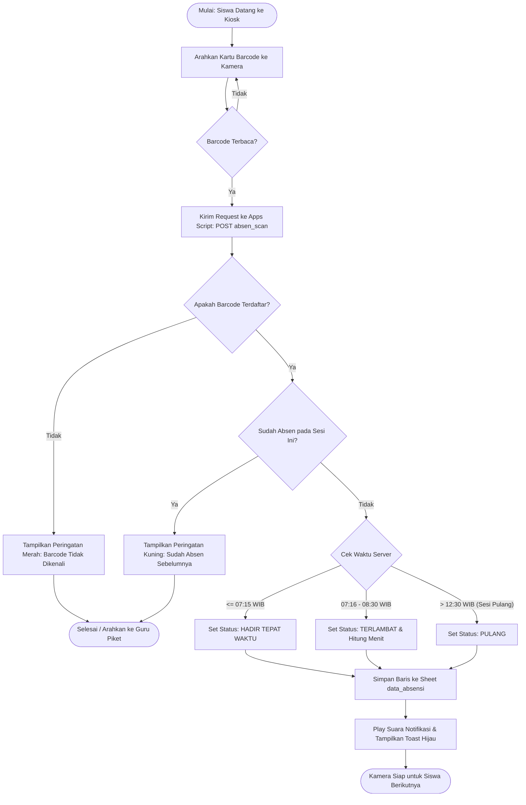
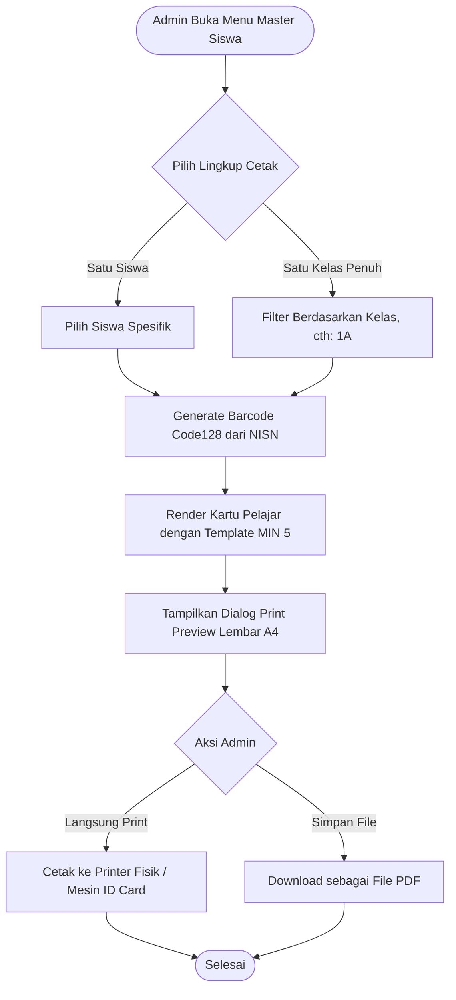
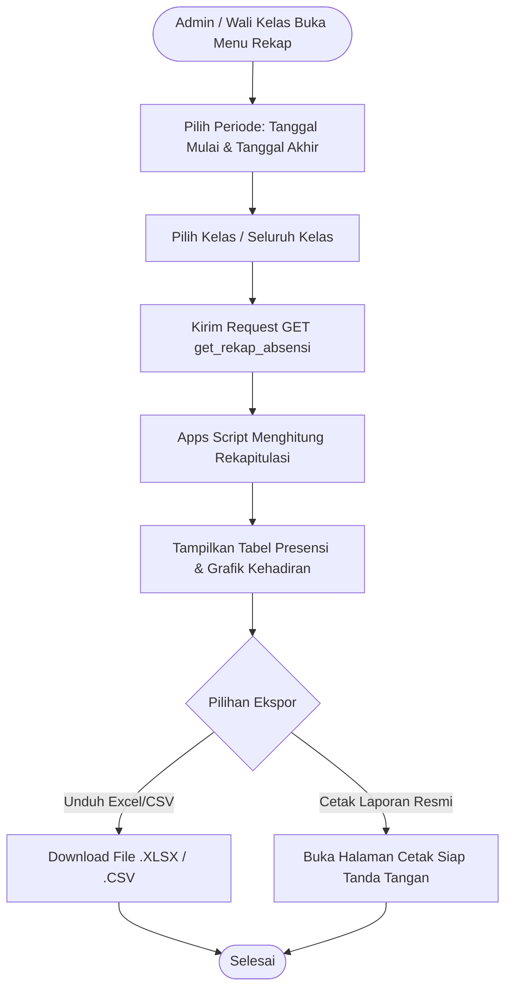

# 🔄 Alur Sistem & Diagram Use Case
# **SIPRESMATA — MIN 5 Tulungagung**
> *"Pantau Kehadiran, Wujudkan Madrasah Cerdas."*

---

### 1. Deskripsi Alur Langkah-demi-Langkah

#### 1.1. Alur Siswa Melakukan Absensi (Scan Barcode Kiosk)
1. **Inisialisasi**: Petugas piket/siswa membuka halaman Scanner pada browser perangkat (tablet/laptop dengan webcam atau HP). Kamera web otomatis aktif.
2. **Pemindaian**: Siswa mendekatkan kartu pelajar/barcode ke depan lensa kamera.
3. **Deteksi & Decoding**: Modul pemindai (HTML5 Barcode Scanner) mendeteksi kode barcode (format `MIN5-XXXXXXXXXX`).
4. **Pengiriman Data**: Frontend mengirim request `POST ?action=absen_scan` dengan payload `kode_barcode` ke backend Google Apps Script.
5. **Validasi Server**:
   - Memeriksa keabsahan barcode pada sheet `master_siswa` (atau cache memory).
   - Memeriksa apakah siswa sudah melakukan scan masuk/pulang pada tanggal hari ini di sheet `data_absensi`.
   - Menguji jam saat ini terhadap konfigurasi jam sekolah (Tepat Waktu vs Terlambat).
6. **Pencatatan**: Server menyisipkan baris baru pada `data_absensi`.
7. **Umpan Balik (Feedback)**:
   - Frontend menerima response JSON sukses.
   - Layar menampilkan pop-up hijau dengan **Foto/Avatar, Nama Lengkap, Kelas, Jam Masuk, dan Status ("HADIR TEPAT WAKTU")**.
   - Sistem memutar suara audio sintesis: *"Selamat pagi [Nama], Absen masuk berhasil, tepat waktu"*.
   - Kamera kembali siap memindai siswa berikutnya dalam jeda 1.5 detik.

---

#### 1.2. Alur Admin Generate & Cetak Barcode Siswa
1. **Akses Menu**: Admin masuk ke menu **Master Data Siswa** pada Dashboard Admin.
2. **Pilih Siswa / Kelas**: Admin memilih tombol "Cetak Kartu" (bisa per individu atau opsi **Cetak 1 Kelas Penuh**).
3. **Rendering Barcode**: Sistem secara dinamis menghasilkan visual barcode Code128 / QR Code beresolusi tinggi menggunakan library client-side (seperti `JsBarcode` / `QRCode.js`).
4. **Pratinjau Tata Letak (Print Preview)**: Sistem menyusun kartu-kartu siswa ke dalam format grid kertas A4 (berisi 8–10 ID Card per lembar lengkap dengan Kop MIN 5, Foto/Ilustrasi, Nama, NISN, dan Barcode).
5. **Cetak / Unduh PDF**: Admin menekan tombol "Print" atau "Simpan ke PDF" untuk dicetak fisik dan dibagikan ke siswa.

---

#### 1.3. Alur Admin Melihat & Mengekspor Rekapitulasi Absensi
1. **Akses Menu**: Admin/Wali Kelas membuka menu **Rekap Absensi**.
2. **Terapkan Filter**: Memilih rentang tanggal (misal: 1 s.d. 31 Agustus 2026) dan memilih kelas (misal: "Kelas 1A").
3. **Tampilkan Data**: Sistem memuat tabel presensi yang memperlihatkan ringkasan: Total Hadir, Terlambat, Izin, Sakit, Alpa, dan persentase kehadiran masing-masing siswa.
4. **Ekspor Laporan**:
   - Admin mengklik tombol **"Export ke Excel (.xlsx / .csv)"** atau **"Cetak Format Laporan Bulanan"**.
   - Sistem menghasilkan file spreadsheet yang siap ditandatangani oleh Kepala Madrasah MIN 5.

---

#### 1.4. Penanganan Kondisi Khusus (Edge Cases & Exception Flows)

- **Kasus A: Barcode Tidak Dikenali / Rusak**:
  - *Sistem*: Menampilkan kartu merah "Barcode Tidak Terdaftar". Mengeluarkan bunyi *beep* peringatan.
  - *Solusi*: Siswa diarahkan ke Guru Piket untuk melakukan absensi manual atau cetak ulang kartu barcode.
- **Kasus B: Siswa Melakukan Scan 2 Kali (Double Scan)**:
  - *Sistem*: Mengembalikan status error `ALREADY_SCANNED`. Pop-up kuning menampilkan notifikasi *"Siswa [Nama] sudah absen masuk pukul 07:02 WIB"*.
  - *Hasil*: Tidak ada baris duplikat yang tercatat di Google Sheets.
- **Kasus C: Siswa Datang Terlambat (> 07.15 WIB)**:
  - *Sistem*: Tetap mencatat status `TERLAMBAT` dan menghitung jumlah menit keterlambatan secara otomatis.
- **Kasus D: Jaringan Internet Sekolah Terputus (Offline Resilience)**:
  - *Sistem*: Frontend menyimpan antrean scan ke dalam browser `IndexedDB` lokal dengan status *Pending Sync*.
  - *Pemulihan*: Begitu koneksi internet aktif kembali, frontend otomatis mengirim data antrean ke Apps Script secara berurutan.

---

### 2. Diagram Alur (Flowchart Mermaid)

#### 2.1. Flowchart Pemindaian Absensi Siswa

---

#### 2.2. Flowchart Generate & Cetak Kartu Barcode Siswa

---

#### 2.3. Flowchart Rekapitulasi & Ekspor Absensi

---

### 3. Tabel Use Case Lengkap

| No | Aktor | Use Case | Deskripsi Singkat | Prasyarat | Hasil Akhir |
|---|---|---|---|---|---|
| **UC-01** | Siswa / Kiosk | Scan Barcode Masuk | Siswa memindai barcode kartu untuk mencatat kehadiran pagi. | Kamera aktif & jam operasional pagi. | Kehadiran tercatat (Hadir/Terlambat), muncul notifikasi audio-visual. |
| **UC-02** | Siswa / Kiosk | Scan Barcode Pulang | Siswa memindai barcode kartu saat jam kepulangan sekolah. | Sudah masuk jam pulang (>= 12.30 WIB). | Jam pulang tercatat pada data absensi hari tersebut. |
| **UC-03** | Admin / Guru | Login Sistem | Masuk ke dashboard manajemen dengan username & kata sandi. | Memiliki akun admin aktif. | Berhasil login dan mendapatkan sesi token admin. |
| **UC-04** | Admin | Kelola Data Siswa | Menambah data siswa baru, mengedit profil siswa, atau menonaktifkan siswa lulus. | Login sebagai Admin. | Data siswa di sheet `master_siswa` terbarui. |
| **UC-05** | Admin | Cetak Kartu Barcode | Menghasilkan dan mencetak kartu barcode siswa per orang atau massal per kelas. | Siswa terdaftar & memiliki NISN. | File PDF / cetakan fisik kartu siap dibagikan ke siswa. |
| **UC-06** | Guru Piket | Input Izin / Sakit / Alpa | Mengisi status kehadiran siswa yang berhalangan hadir secara manual disertai alasan. | Login sebagai Guru Piket / Admin. | Status kehadiran siswa hari itu terisi sebagai Izin/Sakit/Alpa. |
| **UC-07** | Admin / Wali Kelas | Lihat & Ekspor Rekap | Melihat ringkasan presensi harian/bulanan dan mengunduh laporan Excel. | Login sebagai Admin / Wali Kelas. | Laporan presensi berhasil diunduh dalam format Excel/PDF. |
| **UC-08** | Admin | Konfigurasi Jam Sekolah | Mengatur jam buka/tutup scan masuk, batas terlambat, dan jam pulang. | Login sebagai Super Admin. | Parameter jam operasional di sheet `pengaturan_sekolah` terbarui. |
