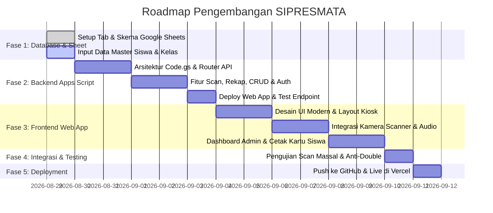

# 📌 Rencana Pengerjaan & Task Breakdown Proyek
# **SIPRESMATA**
### *"Pantau Kehadiran, Wujudkan Madrasah Cerdas."*
> Slogan: *"MADRASAH RAMAH ANAK • MADRASAH ADIWIYATA • TIADA HARI TANPA PRESTASI"*

---

### 🌐 Informasi Repositori & Basis Data
- **Nama Aplikasi**: SIPRESMATA (Sistem Informasi Presensi Siswa Madrasah Terpadu)
- **Target Madrasah**: MIN 5 Tulungagung (Kelas 1A-D s.d. 6A-D)
- **Database Spreadsheet**: [Buka Google Sheets Database](https://docs.google.com/spreadsheets/d/1BbmMgggGUSOhnXfMW4VMzg7u_L9HGWfuPRbd7c1JM7ksOgEeF8_TwgXh/edit?usp=sharing)
  - `SPREADSHEET_ID`: `1BbmMgggGUSOhnXfMW4VMzg7u_L9HGWfuPRbd7c1JM7ksOgEeF8_TwgXh`
- **GitHub Repository**: [csmin5tulungagung-alt/sipresmata](https://github.com/csmin5tulungagung-alt/sipresmata.git)
- **Target Deployment**: Vercel (Frontend Web App) + Google Apps Script Web App (Backend API)

---

## 🗺️ Roadmap & Fase Pengerjaan

---

## 📋 Rincian Task per Fase

### 🟦 FASE 1: Penyiapan Database & Konfigurasi Google Sheets
**Tujuan**: Menyiapkan struktur tab data pada spreadsheet resmi yang siap menerima transaksi tanpa kendala format.

- [ ] **TASK-1.1**: Buat 6 Sheet Utama pada Google Spreadsheet (`1omNmjeUB29BGNeNRlwPM2TSgTd4CLgQarT9EB_93a5A`):
  - [ ] Tab `master_siswa` (Header kolom di baris 1)
  - [ ] Tab `master_kelas` (Tingkat 1A, 1B, 1C, 1D hingga 6A, 6B, 6C, 6D)
  - [ ] Tab `data_absensi`
  - [ ] Tab `users_admin`
  - [ ] Tab `pengaturan_sekolah`
  - [ ] Tab `log_aktivitas`
- [ ] **TASK-1.2**: Isi Data Default pada `pengaturan_sekolah`:
  - `nama_madrasah`: `MIN 5 TULUNGAGUNG`
  - `jam_masuk_mulai`: `06:00:00`
  - `jam_masuk_batas`: `07:15:00` (Batas tepat waktu)
  - `jam_masuk_maksimal`: `08:30:00` (Batas akhir scan terlambat)
  - `jam_pulang_mulai`: `12:30:00`
  - `jam_pulang_batas`: `16:00:00`
- [ ] **TASK-1.3**: Isi Data Awal pada `users_admin`:
  - Buat akun super admin utama dan akun guru piket.
- [ ] **TASK-1.4**: Isi Sampel Data Siswa pada `master_siswa` untuk pengujian awal.

---

### 🟩 FASE 2: Pengembangan Backend Google Apps Script (`Code.gs`)
**Tujuan**: Membangun API serverless yang menangani seluruh alur logika bisnis secara cepat dan aman.

- [ ] **TASK-2.1**: Inisialisasi Script Project di Google Apps Script yang terhubung ke Spreadsheet ID.
- [ ] **TASK-2.2**: Implementasi `doGet(e)` dan `doPost(e)` Router Engine:
  - Format output JSON dengan header CORS (`Access-Control-Allow-Origin: *`).
- [ ] **TASK-2.3**: Endpoint Pemindaian Barcode (`action=absen_scan`):
  - [ ] Validasi keberadaan barcode di cache/sheet `master_siswa`.
  - [ ] Pengecekan *anti-duplicate scan* pada tanggal & sesi yang sama.
  - [ ] Kalkulasi status `HADIR` (Tepat Waktu) atau `TERLAMBAT` (+ hitung menit).
  - [ ] Generate string teks audio untuk sintesis suara feedback.
  - [ ] Batch write / `appendRow` ke sheet `data_absensi`.
- [ ] **TASK-2.4**: Endpoint Autentikasi Admin (`action=login_admin`):
  - [ ] Validasi username & hash password.
  - [ ] Penerbitan session token aman.
- [ ] **TASK-2.5**: Endpoint Master Data Siswa & Kelas:
  - [ ] `action=get_siswa` (Filter kelas & status).
  - [ ] `action=save_siswa` (Tambah & update data, auto generate format kode barcode `MIN5-[NISN]`).
  - [ ] `action=delete_siswa` (Nonaktifkan siswa).
  - [ ] `action=get_kelas` (Ambil daftar rombel 1A-D s.d. 6A-D).
- [ ] **TASK-2.6**: Endpoint Rekapitulasi & Input Manual:
  - [ ] `action=get_rekap_absensi` (Filter rentang tanggal & kelas, kalkulasi total kehadiran).
  - [ ] `action=manual_absen` (Pencatatan Izin, Sakit, Alpa oleh guru piket).
  - [ ] `action=get_dashboard_stats` (Statistik harian *real-time*).
- [ ] **TASK-2.7**: Optimasi Kecepatan dengan `CacheService` Apps Script (TTL 6 jam untuk data master siswa).
- [ ] **TASK-2.8**: Deploy Backend sebagai **Web App** (`Execute as: Me`, `Access: Anyone`) dan catat URL Deployment.

---

### 🟧 FASE 3: Pengembangan Frontend Web App (UI/UX SIPRESMATA)
**Tujuan**: Membangun antarmuka web modern, interaktif, responsif, berestetika tinggi, dan ramah pengguna (HP, Tablet, Laptop Kiosk).

- [ ] **TASK-3.1**: Setup Project Frontend (Vite / Vanilla Modern Single Page Application):
  - Konfigurasi struktur file: `index.html`, `src/styles/`, `src/js/`, `src/components/`, `assets/`.
  - Integrasi tema warna modern Madrasah: *Emerald Green, Teal, Slate Dark Mode & Gold Accent*.
- [ ] **TASK-3.2**: Modul Kiosk Scanner (Halaman Utama / Siswa):
  - [ ] Integrasi kamera live scanner (Library `html5-qrcode` / `BarcodeDetector API`).
  - [ ] Selector pilihan kamera (Depan/Belakang/Webcam USB).
  - [ ] Kartu overlay feedback instan (Foto, Nama, Kelas, Status, Jam Scan).
  - [ ] Audio feedback sintesis suara bahasa Indonesia (*Web Speech API*) + sound effect *beep* keberhasilan/kegagalan.
  - [ ] Jam digital besar *real-time* & status sesi sekolah (Masuk / Terlambat / Pulang).
- [ ] **TASK-3.3**: Modul Login Admin & Sesi:
  - [ ] Form login admin dengan proteksi PIN / Sandi.
  - [ ] Manajemen sesi di LocalStorage / SessionStorage.
- [ ] **TASK-3.4**: Modul Dashboard Utama Admin:
  - [ ] Statistik ringkas harian (Kartu metrik: Total Hadir, Terlambat, Izin, Sakit, Alpa, Belum Hadir).
  - [ ] Tabel live monitoring presensi hari ini (auto refresh).
- [ ] **TASK-3.5**: Modul Generator & Cetak Kartu Barcode Siswa:
  - [ ] Desain template ID Card siswa MIN 5 (Kop Madrasah, Logo Kemenag/MIN 5, Nama, NISN, Kelas, Barcode Code128 / QR).
  - [ ] Fitur cetak massal (Layout Grid Kertas A4 berisi 8–10 kartu siap print / export PDF).
  - [ ] Fitur download barcode perorangan.
- [ ] **TASK-3.6**: Modul Rekapitulasi & Ekspor:
  - [ ] Filter multi-kriteria (Tingkat/Kelas 1A-D s.d 6A-D, Rentang Tanggal).
  - [ ] Tabel rekapitulasi kehadiran dengan persentase.
  - [ ] Fitur Ekspor ke format Excel (`.xlsx`), CSV, dan tampilan Cetak Laporan Resmi.
- [ ] **TASK-3.7**: Modul Input Presensi Manual:
  - [ ] Form pencatatan siswa Izin / Sakit / Alpa dengan upload catatan/keterangan.
- [ ] **TASK-3.8**: Modul Master Data Siswa & Kelas:
  - [ ] Tabel CRUD siswa (Pencarian cepat, filter kelas, form modal tambah/edit).
  - [ ] Fitur import data siswa dari file Excel.

---

### 🟨 FASE 4: Pengujian Menyeluruh (Testing & Quality Assurance)
**Tujuan**: Memastikan keandalan sistem saat jam sibuk kedatangan siswa madrasah (06.30 - 07.15 WIB).

- [ ] **TASK-4.1**: Pengujian Pemindaian Beruntun (*High-throughput Scan*):
  - Uji scan 30–50 siswa secara berturut-turut untuk memastikan responsivitas dan stabilitas kamera.
- [ ] **TASK-4.2**: Pengujian Kasus Khusus & Edge Cases:
  - [ ] Uji scan barcode ganda di hari yang sama -> Pastikan muncul pesan penolakan yang ramah.
  - [ ] Uji scan barcode tidak terdaftar -> Pastikan muncul peringatan merah & nada peringatan.
  - [ ] Uji scan pada jam terlambat -> Pastikan status otomatis berubah menjadi `TERLAMBAT`.
- [ ] **TASK-4.3**: Pengujian Responsif Antarmuka (Cross-Device):
  - Uji di Google Chrome Android, Safari iOS, Laptop Windows, dan Tablet Kiosk.

---

### 🟪 FASE 5: Deployment & Integrasi GitHub / Vercel
**Tujuan**: Mempublikasikan aplikasi ke internet agar dapat diakses dari perangkat sekolah mana pun.

- [ ] **TASK-5.1**: Hubungkan Repositori Lokal ke GitHub:
  - Remote: `https://github.com/csmin5tulungagung-alt/sipresmata.git`
  - Push branch `main` dengan kode yang bersih dan terstruktur.
- [ ] **TASK-5.2**: Konfigurasi & Deploy ke Vercel:
  - Sambungkan repositori GitHub ke project Vercel.
  - Konfigurasi Environment Variables (`VITE_APPS_SCRIPT_URL`, `VITE_CLIENT_KEY`).
  - Lakukan *Production Build* dan uji domain aktif (`sipresmata.vercel.app`).

---

### 🟫 FASE 6: Dokumentasi & Serah Terima Penggunaan (Handover)
**Tujuan**: Memberikan panduan operasional kepada petugas piket, wali kelas, dan tim IT MIN 5.

- [ ] **TASK-6.1**: Buat Buku Panduan Admin (`USER_MANUAL_ADMIN.md`).
- [ ] **TASK-6.2**: Buat Panduan Standar Operasional Kiosk (`SOP_KIOSK_SCANNER.md`).
- [ ] **TASK-6.3**: Pembuatan Template Format Import Data Siswa (.xlsx).

---

## 🎯 Status Progres Proyek

| Fase | Deskripsi | Jumlah Task | Status |
| :--- | :--- | :---: | :---: |
| **Fase 1** | Penyiapan Database Google Sheets | 4 Task | 🟡 Siap Dikerjakan |
| **Fase 2** | Backend Google Apps Script (`Code.gs`) | 8 Task | ⚪ Menunggu Fase 1 |
| **Fase 3** | Frontend Web App SIPRESMATA | 8 Task | ⚪ Menunggu Fase 2 |
| **Fase 4** | Pengujian & QA | 3 Task | ⚪ Menunggu Fase 3 |
| **Fase 5** | Deployment GitHub & Vercel | 2 Task | ⚪ Menunggu Fase 4 |
| **Fase 6** | Dokumentasi & SOP | 3 Task | ⚪ Menunggu Fase 5 |
